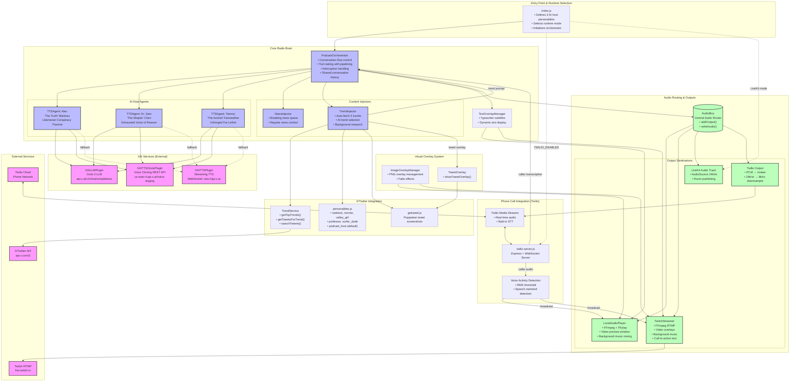
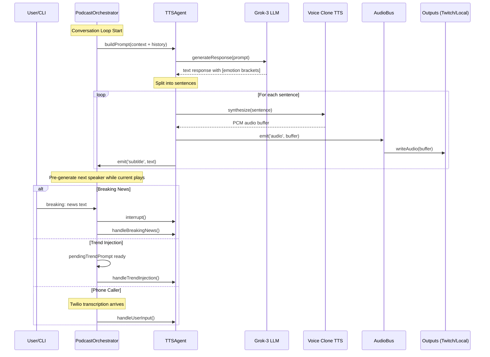
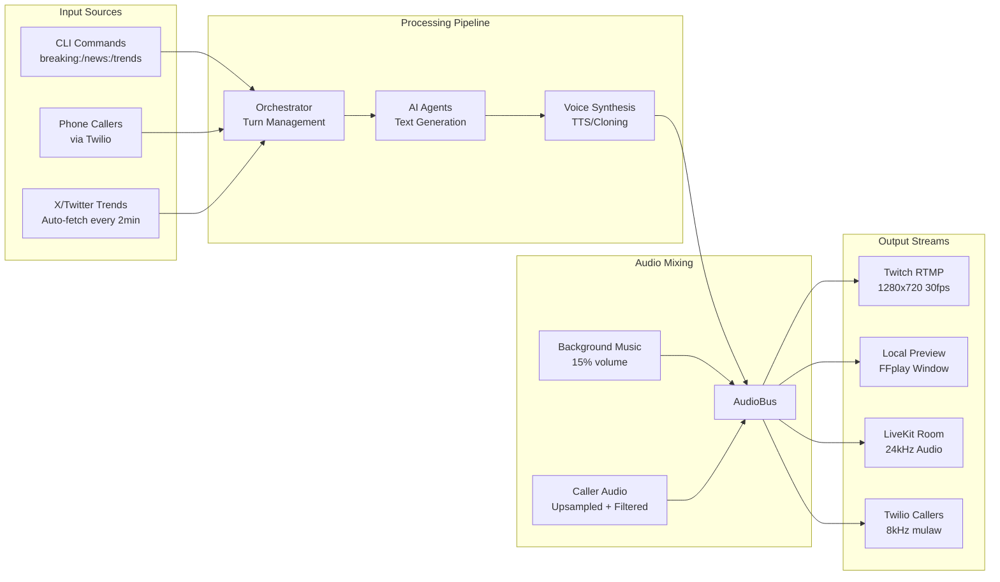

# Grokkdio FM - Architecture Documentation

## Overview

Grokkdio FM is a 24/7 AI-powered radio station that streams to Twitch with multiple AI hosts, live phone call-ins, and real-time X/Twitter trend integration. The system is built on Node.js and uses XAI's Grok-3 LLM and voice synthesis APIs.

---

## Detailed Architecture Diagram



---

## Component Interaction Diagram



---

## Data Flow Diagram



---

## Runtime Modes

The system supports three runtime modes, selected via environment variables:

| Mode | Env Variable | Output | Use Case |
|------|-------------|--------|----------|
| **Local Preview** | `LOCAL_MODE=true` | FFplay window | Development/testing |
| **Twitch Streaming** | `TWITCH_MODE=true` | RTMP to Twitch | Production streaming |
| **LiveKit** | Default (no flags) | LiveKit room | WebRTC distribution |

---

## LiveKit Integration (ASCII Diagram)

Grokkdio FM uses the **LiveKit Agents Framework** (`@livekit/agents`) as its default runtime mode. This enables real-time WebRTC audio distribution to multiple listeners through LiveKit rooms.

```
┌─────────────────────────────────────────────────────────────────────────────┐
│                         LIVEKIT AGENTS FRAMEWORK                            │
├─────────────────────────────────────────────────────────────────────────────┤
│                                                                             │
│   ┌─────────────────────────────────────────────────────────────────────┐   │
│   │                         index.js                                    │   │
│   │                                                                     │   │
│   │   import { WorkerOptions, cli, defineAgent } from "@livekit/agents" │   │
│   │                                                                     │   │
│   │   export default defineAgent({                                      │   │
│   │     entry: async (ctx) => {                                         │   │
│   │       const podcast = new PodcastOrchestrator(AGENT_CONFIGS, topic) │   │
│   │       await podcast.initialize(ctx.room)  ◄── LiveKit Room passed   │   │
│   │       await podcast.runPodcast()                                    │   │
│   │     }                                                               │   │
│   │   })                                                                │   │
│   │                                                                     │   │
│   │   // Starts LiveKit worker via CLI                                  │   │
│   │   cli.runApp(new WorkerOptions({ agent: ... }))                     │   │
│   └─────────────────────────────────────────────────────────────────────┘   │
│                                    │                                        │
│                                    ▼                                        │
│   ┌─────────────────────────────────────────────────────────────────────┐   │
│   │                    PodcastOrchestrator.initialize(room)             │   │
│   │                                                                     │   │
│   │   import { AudioSource } from "@livekit/rtc-node"                   │   │
│   │                                                                     │   │
│   │   if (room) {                                                       │   │
│   │     // Create 24kHz mono audio source                               │   │
│   │     this.audioSource = new AudioSource(24000, 1)                    │   │
│   │                                                                     │   │
│   │     // Publish audio track to LiveKit room                          │   │
│   │     await room.localParticipant.publishTrack({                      │   │
│   │       source: this.audioSource,                                     │   │
│   │       name: "podcast-audio"                                         │   │
│   │     })                                                              │   │
│   │                                                                     │   │
│   │     // Register with AudioBus for unified routing                   │   │
│   │     audioBus.addOutput({                                            │   │
│   │       name: "LiveKit",                                              │   │
│   │       writeAudio: (buffer) => this.audioSource.captureFrame(buffer) │   │
│   │     })                                                              │   │
│   │   }                                                                 │   │
│   └─────────────────────────────────────────────────────────────────────┘   │
│                                                                             │
└─────────────────────────────────────────────────────────────────────────────┘

                                    │
                                    │ Audio flows through AudioBus
                                    ▼

┌─────────────────────────────────────────────────────────────────────────────┐
│                              AUDIO FLOW                                     │
├─────────────────────────────────────────────────────────────────────────────┤
│                                                                             │
│   TTSAgent ──► emit('audio', buffer) ──► AudioBus.writeAudio(buffer)        │
│                                              │                              │
│                                              ▼                              │
│                          ┌───────────────────────────────────┐              │
│                          │         AudioBus (Singleton)      │              │
│                          │                                   │              │
│                          │   outputs.forEach(output =>       │              │
│                          │     output.writeAudio(buffer)     │              │
│                          │   )                               │              │
│                          └───────────────────────────────────┘              │
│                                              │                              │
│                    ┌─────────────┬───────────┼───────────┬─────────────┐    │
│                    ▼             ▼           ▼           ▼             ▼    │
│              ┌──────────┐ ┌──────────┐ ┌──────────┐ ┌──────────┐           │
│              │ LiveKit  │ │  Twitch  │ │  Local   │ │  Twilio  │           │
│              │  Room    │ │  RTMP    │ │  FFplay  │ │  Callers │           │
│              └──────────┘ └──────────┘ └──────────┘ └──────────┘           │
│                   │                                                         │
│                   ▼                                                         │
│         audioSource.captureFrame(buffer)                                    │
│                   │                                                         │
│                   ▼                                                         │
│         ┌─────────────────────────────────┐                                 │
│         │     LiveKit Cloud / Server      │                                 │
│         │                                 │                                 │
│         │   Room: "podcast-room"          │                                 │
│         │   Track: "podcast-audio"        │                                 │
│         │   Format: 24kHz PCM mono        │                                 │
│         └─────────────────────────────────┘                                 │
│                   │                                                         │
│                   ▼                                                         │
│         ┌─────────────────────────────────┐                                 │
│         │      WebRTC Subscribers         │                                 │
│         │                                 │                                 │
│         │   • Web browsers                │                                 │
│         │   • Mobile apps                 │                                 │
│         │   • Other LiveKit clients       │                                 │
│         └─────────────────────────────────┘                                 │
│                                                                             │
└─────────────────────────────────────────────────────────────────────────────┘
```

### LiveKit-Twilio Bridge (Alternative Architecture)

There's also a `twilio-livekit-bridge.js` that connects phone callers directly to a LiveKit room:

```
┌─────────────────────────────────────────────────────────────────────────────┐
│                        TWILIO-LIVEKIT BRIDGE                                │
├─────────────────────────────────────────────────────────────────────────────┤
│                                                                             │
│   Phone Caller                                                              │
│       │                                                                     │
│       ▼                                                                     │
│   ┌──────────────────┐                                                      │
│   │   Twilio Cloud   │                                                      │
│   │   (Phone Network)│                                                      │
│   └────────┬─────────┘                                                      │
│            │ WebSocket (Media Streams)                                      │
│            ▼                                                                │
│   ┌──────────────────────────────────────────────────────────────────┐      │
│   │                  twilio-livekit-bridge.js                        │      │
│   │                                                                  │      │
│   │   • Express server on port 3001                                  │      │
│   │   • /voice endpoint returns TwiML with <Stream>                  │      │
│   │   • /media-stream WebSocket handles bidirectional audio          │      │
│   │                                                                  │      │
│   │   On call start:                                                 │      │
│   │     1. Connect to LiveKit room using @livekit/rtc-node           │      │
│   │     2. Generate access token with livekit-server-sdk             │      │
│   │     3. Subscribe to room's audio tracks                          │      │
│   │                                                                  │      │
│   │   Audio flow:                                                    │      │
│   │     LiveKit → downsample 48kHz→8kHz → PCM→mulaw → Twilio caller  │      │
│   │     Twilio caller → mulaw→PCM → (TODO: publish to LiveKit room)  │      │
│   └──────────────────────────────────────────────────────────────────┘      │
│            │                                                                │
│            │ @livekit/rtc-node                                              │
│            ▼                                                                │
│   ┌──────────────────┐                                                      │
│   │   LiveKit Room   │                                                      │
│   │   "podcast-room" │                                                      │
│   └──────────────────┘                                                      │
│                                                                             │
└─────────────────────────────────────────────────────────────────────────────┘
```

### Key LiveKit Components Used

| Package | Purpose |
|---------|---------|
| `@livekit/agents` | Agent framework - `defineAgent()`, `WorkerOptions`, `cli.runApp()` |
| `@livekit/rtc-node` | Real-time communication - `AudioSource`, `Room`, `RoomEvent` |
| `livekit-server-sdk` | Server-side utilities - `AccessToken` generation |

### LiveKit Environment Variables

```bash
# Required for LiveKit mode (when neither LOCAL_MODE nor TWITCH_MODE is set)
LIVEKIT_URL=wss://your-livekit-server.com
LIVEKIT_API_KEY=your-api-key
LIVEKIT_API_SECRET=your-api-secret
```

---

## Key Component Responsibilities

### PodcastOrchestrator
- Central conversation controller
- Manages turn-taking between 3 AI hosts
- Implements response pipelining (pre-generates next response while current plays)
- Handles interruptions (breaking news, user input, trends)
- Maintains shared conversation history for context

### TTSAgent
- Represents a single AI host with personality
- Uses Grok-3 for text generation with emotion brackets
- Uses voice cloning for consistent character voices
- Sentence-by-sentence playback with interruption support
- Emits audio and subtitle events

### AudioBus
- Singleton audio router
- Distributes PCM audio to all registered outputs
- Simple interface: `addOutput()`, `removeOutput()`, `writeAudio()`

### TrendInjector
- Fetches trending topics from X/Twitter API
- Uses AI to select most interesting trend for show format
- Performs background research on selected trend
- Builds prompts with trend context and top tweets
- Triggers tweet screenshot overlays

### twilio-server.js
- Express server for Twilio webhooks
- WebSocket server for Media Streams
- Voice Activity Detection for caller speech
- Bidirectional audio: podcast → caller, caller → stream
- Real-time transcription integration

---

## Audio Format Specifications

| Component | Sample Rate | Channels | Bit Depth | Format |
|-----------|-------------|----------|-----------|--------|
| Internal Pipeline | 24kHz | Mono | 16-bit | PCM s16le |
| Twitch Output | 48kHz | Stereo | - | AAC 128kbps |
| Twilio Input | 8kHz | Mono | 8-bit | mulaw |
| Twilio Output | 8kHz | Mono | 8-bit | mulaw |
| Voice Clone API | - | - | - | MP3 → PCM |

---

## Environment Variables

```bash
# Required
XAI_API_KEY=your-xai-api-key

# Runtime Mode (pick one)
LOCAL_MODE=true          # Local preview
TWITCH_MODE=true         # Twitch streaming
# (neither = LiveKit mode)

# Twitch Streaming
TWITCH_STREAM_KEY=your-stream-key
TWITCH_RTMP_URL=rtmp://live.twitch.tv/app/

# Phone Call-Ins
TWILIO_ENABLED=true
TWILIO_ACCOUNT_SID=your-sid
TWILIO_AUTH_TOKEN=your-token
TWILIO_SERVER_PORT=3001

# X/Twitter Trends
X_BEARER_TOKEN=your-bearer-token

# Optional
BACKGROUND_VIDEO=./media/gta.mp4
BACKGROUND_MUSIC=./media/background-music.mp3
ENABLE_SUBTITLES=true
AI_INTERRUPTION_CHANCE=0.0
```

---

## File Structure

```
src/
├── index.js                      # Entry point, agent configs, mode selection
├── twilio-server.js              # Phone call integration server
├── twilio-livekit-bridge.js      # LiveKit-Twilio bridge (alternative)
│
├── lib/
│   ├── PodcastOrchestrator.js    # Central conversation orchestration
│   ├── TTSAgent.js               # Individual AI host agent
│   ├── AudioBus.js               # Central audio routing
│   ├── NewsInjector.js           # Breaking/regular news management
│   ├── TrendInjector.js          # X trends fetching and injection
│   ├── TrendService.js           # X/Twitter API client
│   ├── TextOverlay.js            # Subtitle/text overlay manager
│   ├── TweetOverlay.js           # Tweet screenshot overlay helper
│   ├── ImageOverlayManager.js    # PNG overlay management
│   ├── gettweet.js               # Puppeteer tweet capture
│   └── personalities.js          # Trend selection personalities
│
├── plugins/
│   ├── xai-llm.js                # Grok LLM API wrapper
│   ├── xai-tts.js                # XAI streaming TTS (WebSocket)
│   ├── xai-tts-clone.js          # XAI voice cloning (REST)
│   ├── xai-realtime.js           # XAI Realtime API (alternative)
│   ├── twitch-streamer.js        # FFmpeg RTMP streaming
│   └── local-audio-player.js     # Local preview player
│
└── media/
    ├── alex-jones.m4a            # Voice clone reference (Alex)
    ├── parsa.m4a                  # Voice clone reference (Sam)
    ├── tammy.m4a                  # Voice clone reference (Tammy)
    ├── background-music.mp3      # Lofi background music
    ├── dial_in.mp3               # Phone dial-in sound effect
    └── hang_up.mp3               # Phone hang-up sound effect
```
